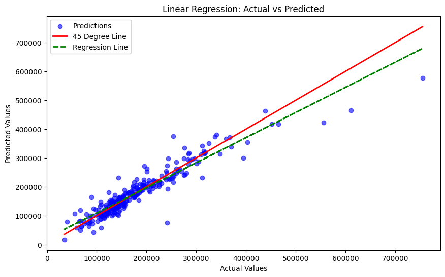

# 🏡 House Prices Prediction

## Overview
This project predicts the **sale price (`SalePrice`)** of houses using machine learning.  
The model estimates prices for houses in the test dataset based on features from the training data.  

## Why This Project is Useful
Accurate house price prediction can help:

- Buyers and sellers estimate fair market value.  
- Real estate professionals make smarter decisions.  
- Data science learners practice regression, feature engineering, and model evaluation.

## Dataset
- **train.csv**: Training data with house features and target variable (`SalePrice`).  
- **test.csv**: Test data with house features only.  
- **sample_submission.csv**: Template for submitting predictions.
- **To Download the dataset**: [Kaggle House Prices Competition](https://www.kaggle.com/c/house-prices-advanced-regression-techniques/data)


## Libraries & Tools
- **Python**: `numpy`, `pandas`, `math`  
- **Data Visualization**: `matplotlib`, `seaborn`  
- **Machine Learning**: `scikit-learn`  

## Project Workflow
1. **Data Import & Exploration**  
   Load datasets, inspect shapes, and explore distributions.

2. **Data Cleaning**  
   - Remove columns with many missing values.  
   - Fill missing numerical values with the mean.  
   - Encode categorical features using one-hot encoding.

3. **Feature Selection & Alignment**  
   Separate features from the target variable and align test set columns.

4. **Train/Test Split**  
   Split training data into **training (80%)** and **validation (20%)** sets.

5. **Model Training**  
   Train a **Linear Regression** model on the training data.

6. **Model Evaluation**  
   Evaluate model performance using **MAE, MSE, RMSE, and R² score**.  

   Visualize predictions with a scatter plot:

   

7. **Prediction & Export**  
   Generate predictions for the test set and export results to `predictions.xlsx`.  

## How to Get Started
1. Clone the repository:  
   ```bash
   git clone https://github.com/latifahxx/house-prices-prediction.git

## Install required libraries:
   ```bash
pip install numpy pandas matplotlib seaborn scikit-learn openpyxl
```

Place the dataset files (train.csv, test.csv, sample_submission.csv) in the project folder.

Run the main notebook or script to train the model and generate predictions.


## Contribution
Contributions are welcome! You can:

- Suggest improvements to the model or preprocessing steps.
- Report issues or bugs.
- Add more visualizations or feature engineering techniques.
